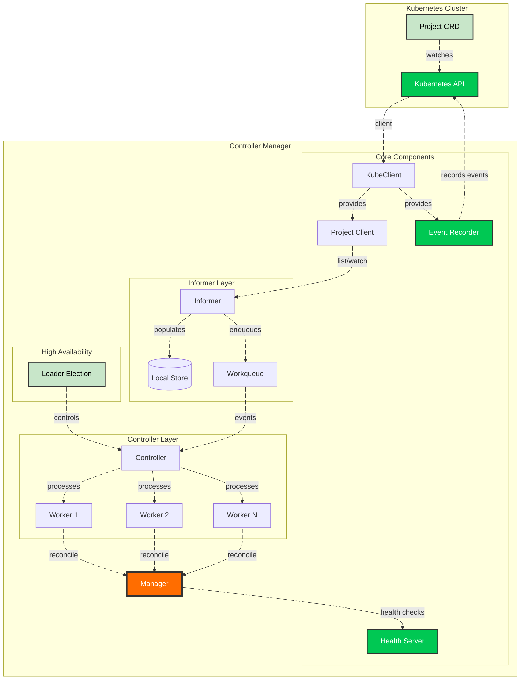

# Kubernetes CRD Controller - Project Operator

[](https://golang.org/)
[](https://kubernetes.io/)
[](LICENSE)

A production-ready Kubernetes controller for managing `Project` custom resources, built with clean architecture, leader election, and graceful shutdown. This project extends the foundational work by [@martin-helmich](https://github.com/martin-helmich/kubernetes-crd-example) on Kubernetes CRD examples, transforming it into a scalable, enterprise-grade controller framework.

## 🎯 **Overview**

This controller manages `Project` custom resources in Kubernetes. It watches for Project CRDs and reconciles their state, ensuring external resources are properly provisioned and cleaned up. Built with extensibility in mind, it demonstrates:

- Custom Resource Definition (CRD) creation and management
- Kubernetes client-go informer patterns
- Leader election for high availability
- Workqueue with rate limiting for reliable processing
- Event recording for Kubernetes events
- Graceful shutdown with context propagation
- Health and readiness probes for production deployments
- Environment-aware logging (noisy probes silenced in production)

## 🏗️ **Architecture**



## ✨ **Features**

- **Custom Resource Management**: Full lifecycle management for `Project` CRDs
- **Leader Election**: High availability with automatic failover
- **Workqueue with Rate Limiting**: Prevents reconcile storms with exponential backoff
- **Configurable Workers**: Scale processing horizontally
- **Event Recording**: Kubernetes events for visibility into controller actions
- **Health & Readiness Probes**: Kubernetes liveness and readiness endpoints with environment-aware logging
- **Graceful Shutdown**: Proper cleanup on termination signals with lease release
- **Structured Logging**: JSON-formatted logs with environment-based verbosity
- **Context Propagation**: Respects cancellation throughout the stack
- **Tombstone Handling**: Gracefully handles deleted objects
- **Environment-based Configuration**: Flexible config via `.env` or system variables
- **Production-Ready Manifests**: Ready-to-use Kubernetes deployments and RBAC

## 📋 **Prerequisites**

- Go 1.21 or higher
- Kubernetes cluster 1.28+ (for testing)
- kubectl configured with cluster access
- Docker (for building container images)

## 🚀 **Quick Start**

### 1. Clone the Repository
```bash
git clone https://github.com/ialexeze/kubernetes-crd-example.git
cd kubernetes-crd-example
```

### 2. Configure Environment
Create a `.env` file (or use system environment variables):

```bash
# Copy example env file
cp .env.example .env

# Edit with your configuration
vim .env
```

### 3. Install CRD
```bash
kubectl apply -f crd-config/crd.yaml
```

### 4. Run Locally
```bash
# Make sure you're in the right namespace context
kubectl config set-context --current --namespace=your-namespace

# Run the controller
go run ./cmd/
```

> **⚠️ Important**: Ensure your current kubectl context is set to the same namespace as configured in `NAMESPACE` env variable. The controller will only watch resources in this namespace.

### 5. Create Project Resources
```bash
# In another terminal
kubectl apply -f crd-config/project.yaml
```

### 6. Deploy the Project Controller with RBAC
```bash
# Apply all Kubernetes manifests (deployment, rbac, etc.)
kubectl apply -f deployment/
```

_You can modify the deployment configuration in the `deployment/` folder to suit your environment:_

- `deployment.yaml` - Controller deployment with health probes
- `rbac.yaml` - ServiceAccount, ClusterRole, and ClusterRoleBinding
- `service.yaml` - Optional service for health endpoints

### 7. Watch the Magic Happen
```bash
# Watch controller logs
kubectl logs -f deployment/project-controller -n your-namespace

# Check projects
kubectl get projects
kubectl get projects -o yaml

# View controller events
kubectl get events --all-namespaces --watch
```

## ⚙️ **Configuration**

The controller supports flexible configuration through environment variables, making it suitable for both development (with `.env` files) and production (with system environment variables).

### Environment Variables

| Variable | Description | Default | Required |
|----------|-------------|---------|----------|
| **Application** |
| `APP_NAME` | Application name | `kubernetes-crd-example` | No |
| `APP_VERSION` | Application version | `1.0.0` | No |
| `APP_ENV` | Environment (dev/staging/prod) | `development` | No |
| **Kubernetes** |
| `KUBECONFIG` | Path to kubeconfig file | `""` | No* |
| `MASTER_URL` | Kubernetes API URL | `""` | No* |
| `IN_CLUSTER` | Use in-cluster config | `false` | No |
| `CLUSTER_NAME` | Cluster identifier | `kubernetes-crd-example` | No |
| `NAMESPACE` | Namespace to watch | `default` | **Yes** |
| **Controller** |
| `DEFAULT_RESYNC` | Informer resync period (seconds) | `15` | No |
| `FINALIZER` | Finalizer string | `alexia.ai/finalizer` | No |
| `LABEL_SELECTOR` | Label selector for filtering | `app=alexia` | No |
| `WORKERS` | Number of reconciler workers | `3` | No |
| **Health Server** |
| `PORT` | Health server port | `5000` | No |
| `SRV_READ_TIMEOUT` | Read timeout (seconds) | `5` | No |
| `SRV_WRITE_TIMEOUT` | Write timeout (seconds) | `20` | No |
| **Leader Election** |
| `LEASE_DURATION` | Leader lease duration (seconds) | `30` | No |
| `RENEW_DEADLINE` | Leader renew deadline (seconds) | `6` | No |
| `RETRY_PERIOD` | Leader retry period (seconds) | `2` | No |

\* Either `KUBECONFIG`/`MASTER_URL` or `IN_CLUSTER=true` must be set

### .env File (Development)

For local development, create a `.env` file in the project root:

```bash
# .env example
APP_NAME=project-controller
APP_VERSION=1.0.0
APP_ENV=development

# Kubernetes
KUBECONFIG=${HOME}/.kube/config
NAMESPACE=default
WORKERS=3
DEFAULT_RESYNC=30

# Health server
PORT=5000

# Leader election
LEASE_DURATION=15
RENEW_DEADLINE=10
RETRY_PERIOD=3
```

The controller automatically loads `.env` files using `godotenv`. In production, you can set these same variables as system environment variables in your container.

## 📖 **API Reference**

### Project CRD

```yaml
apiVersion: crd-example.ialexeze.ai/v1alpha1
kind: Project
metadata:
  name: example-project
  namespace: default
spec:
  replicas: 3                    # Number of desired replicas
  # Additional fields as needed
status:
  availableReplicas: 3           # Current ready replicas
  phase: "Running"                # Current phase
  conditions:                     # Standard condition array
    - type: "Ready"
      status: "True"
      lastTransitionTime: "2024-01-01T00:00:00Z"
      reason: "AllReplicasReady"
      message: "All 3 replicas are ready"
```

## 🔧 **Component Deep Dive**

### 1. **Configuration** (`pkg/config`)
Environment-based configuration with validation:
```go
cfg, err := config.Init() // Automatically loads .env file
```

### 2. **Health Server** (`pkg/health`)
Provides liveness and readiness endpoints with environment-aware logging:
- `/health` - Returns 200 when the service is running (no logs in production)
- `/ready` - Returns 200 only after all components are ready (no logs in production)
- Conditional logging based on `APP_ENV` to prevent noisy probes in production

### 3. **Event Recorder** (`pkg/events`)
Kubernetes event recording for controller visibility:
- Broadcasts events to the Kubernetes API
- Used by leader election and reconciliation to emit status events
- Integrates with `kubectl describe` and `kubectl get events`

### 4. **KubeClient** (`pkg/kubeclient`)
Wraps Kubernetes client operations:
- Built-in types via `clientset`
- CRD operations via `restClient` with custom scheme
- Provides clients to other components

### 5. **Project Client** (`clientset/v1alpha1`)
Type-safe client for Project CRUD operations:
```go
projects, err := client.Projects(namespace).List(ctx, metav1.ListOptions{})
project, err := client.Projects(namespace).Get(ctx, name, metav1.GetOptions{})
```

### 6. **Informer** (`pkg/informer`)
Watches Project resources and maintains a local cache:
- List/Watch with the Kubernetes API
- Thread-safe store for quick access
- Workqueue for event processing
- Automatic resync period

### 7. **Controller** (`pkg/controller`)
Processes events from the queue:
- Manages worker goroutines
- Executes reconciliation logic
- Emits Kubernetes events for visibility
- Handles deletions with tombstone support
- Rate limiting on errors

### 8. **Leader Election** (`pkg/leader`)
Ensures only one instance reconciles:
- Acquires lease via Kubernetes coordination API
- Only leader runs the controller
- Automatic failover
- Emits leader election events

### 9. **Manager** (`pkg/manager`)
Orchestrates all components:
- Ordered startup and shutdown
- Graceful signal handling
- Readiness coordination
- Sets health server ready when all components are running

## 🚀 **Extending the Controller**

The controller is designed to be easily extended for different use cases. The main extension point is the reconciliation logic in [Reconcile.go](./pkg/controller/reconcile.go)

```go
// pkg/controller/reconcile.go
package controller

import (
    "context"
    "github.com/ialexeze/kubernetes-crd-example/pkg/config/api/types/v1alpha1"
    corev1 "k8s.io/api/core/v1"
)

// reconcileNormal handles the normal reconciliation logic
// Override this for custom business logic
func (c *Controller) reconcileNormal(ctx context.Context, project *v1alpha1.Project) error {
    // TODO: Add your custom logic here
    // Examples:
    // - Provision external resources (databases, buckets)
    // - Update dependent Kubernetes resources
    // - Call external APIs
    // - Update status conditions
    
    logger.Debug().Msgf("Normal reconciliation for %s", project.Name)
    
    // Emit Kubernetes event
    if c.events.Recorder() != nil {
        c.events.Recorder().Eventf(
            project,
            corev1.EventTypeNormal,
            "ProjectReconciled",
            "Project %s reconciled successfully", project.Name,
        )
    }
    
    return nil
}

// handleDeletion handles cleanup when a project is deleted
// Override this for custom cleanup logic
func (c *Controller) handleDeletion(ctx context.Context, project *v1alpha1.Project) error {
    // TODO: Add your cleanup logic here
    // Examples:
    // - Delete external resources
    // - Remove finalizers
    // - Notify external systems
    
    logger.Info().Msgf("Handling deletion for %s", project.Name)
    
    // Emit Kubernetes event
    if c.events.Recorder() != nil {
        c.events.Recorder().Eventf(
            project,
            corev1.EventTypeNormal,
            "ProjectDeleted",
            "Project %s cleaned up successfully", project.Name,
        )
    }
    
    return nil
}
```

### Creating a New Resource Type

To add support for a new CRD type:
1. Generate new client files in `clientset/`
2. Create a new informer in `pkg/informer/`
3. Implement a new controller or extend existing one
4. Register in `buildManager()`

## 💓 **Health Checks**

The health server provides crucial Kubernetes probe endpoints with environment-aware logging to prevent noisy logs in production.

### Before Readiness (Starting Up)
```json
curl -sS localhost:5000/ready | jq
{
  "data": {
    "client": "projects",
    "status": 500
  },
  "meta": {
    "message": "projects is not ready",
    "details": {
      "service": "projects",
      "status": "not ready"
    }
  }
}
```

### After Full Startup
```json
curl -sS localhost:5000/ready | jq
{
  "data": {
    "client": "projects",
    "status": 200
  },
  "meta": {
    "message": "projects is ready",
    "details": {
      "service": "projects",
      "status": "running"
    }
  }
}
```

### Liveness Check
```json
curl -sS localhost:5000/health | jq
{
  "data": {
    "client": "projects",
    "status": 200
  },
  "meta": {
    "message": "projects is healthy",
    "details": {
      "service": "projects",
      "status": "online"
    }
  }
}
```

**Note**: In production environments (`APP_ENV=production`), health check requests are not logged to prevent log spam from Kubernetes probes.

## 🔄 **Graceful Shutdown**

The manager handles termination signals (SIGINT, SIGTERM) gracefully, ensuring leader leases are released and all components clean up properly:

```bash
^C
{"level":"info","time":1772677012,"message":"received shutdown signal: interrupt"}
{"level":"info","time":1772677012,"message":"shutting down: health server..."}
{"level":"info","time":1772677012,"message":"health server status: offline"}
{"level":"info","time":1772677012,"message":"shutting down: kubeclient..."}
{"level":"info","time":1772677012,"message":"kubeclient status: offline"}
{"level":"info","time":1772677012,"message":"shutting down: event handler..."}
{"level":"info","time":1772677012,"message":"event handler status: offline"}
{"level":"info","time":1772677012,"message":"shutting down: projects..."}
{"level":"info","time":1772677012,"message":"projects status: offline"}
{"level":"info","time":1772677012,"message":"shutting down: smart informer..."}
{"level":"info","time":1772677012,"message":"shutting down informer"}
{"level":"info","time":1772677012,"message":"smart informer status: offline"}
{"level":"info","time":1772677012,"message":"shutting down: smart controller..."}
{"level":"info","time":1772677012,"message":"shutting down controller"}
{"level":"info","time":1772677012,"message":"smart controller status: offline"}
{"level":"info","time":1772677012,"message":"shutting down: resource-leader..."}
{"level":"info","time":1772677012,"message":"resource-leader status: offline"}
{"level":"info","time":1772677012,"message":"⚠️ All services shut down gracefully"}
```

## 📦 **Deployment**

### Build Container Image
```bash
docker build -t your-registry/project-controller:latest .
docker push your-registry/project-controller:latest
```

### Deploy to Kubernetes

The `deployment/` folder contains ready-to-use manifests:

```bash
# Apply all manifests
kubectl apply -f deployment/

# Or apply individually
kubectl apply -f deployment/rbac.yaml
kubectl apply -f deployment/deployment.yaml
kubectl apply -f deployment/service.yaml  # optional
```

## 🔍 **Troubleshooting**

### Common Issues

1. **"projects in store: 0" even after creating resources**
   - Check namespace: `kubectl config current-context` and ensure it matches `NAMESPACE` env
   - Verify informer sync: Look for "informer cache synced" in logs

2. **Leader election not working / pods crashlooping during rollout**
   - Ensure `terminationGracePeriodSeconds` is set sufficiently high (30s+)
   - Check that leader election is configured with `ReleaseOnCancel: true`
   - Verify RBAC permissions for leases
   - Check old pod logs for "lease released" message

3. **REST client nil errors**
   - Ensure `IN_CLUSTER` is set correctly
   - Check `KUBECONFIG` path validity

4. **No events appearing**
   - Verify RBAC permissions for events
   - Check that event recorder started successfully

### Debugging Tips

```bash
# Check controller logs
kubectl logs -f deployment/project-controller

# Verify CRD exists
kubectl get crd projects.crd-example.ialexeze.ai

# Check leader lease
kubectl get leases -n your-namespace

# Watch events
kubectl get events --all-namespaces --watch

# Check current leader
kubectl get lease resource-leader -n your-namespace -o jsonpath='{.spec.holderIdentity}'
```

## 🤝 **Contributing**

1. Fork the repository
2. Create a feature branch (`git checkout -b feature/amazing-feature`)
3. Commit changes (`git commit -m 'Add amazing feature'`)
4. Push to branch (`git push origin feature/amazing-feature`)
5. Open a Pull Request

### Development Guidelines
- Add tests for new features
- Update documentation
- Follow Go best practices
- Use structured logging
- Handle errors gracefully
- Add events for important controller actions

## 🙏 **Acknowledgments**

This project is an extension and production-hardening of the excellent work by [**@martin-helmich**](https://github.com/martin-helmich) in his [kubernetes-crd-example](https://github.com/martin-helmich/kubernetes-crd-example) repository. His foundational example provided the clear patterns for:

- CRD type definitions
- Basic client generation
- Informer setup patterns

Building upon this foundation, this implementation adds:
- **Manager pattern** with component lifecycle
- **Leader election** with proper lease release on shutdown
- **Workqueue** with rate limiting
- **Event recording** for Kubernetes visibility
- **Health checks** with environment-aware logging
- **Graceful shutdown** handling
- **Configurable workers** for scaling
- **Production logging** with structured output
- **Environment-based configuration** via `.env` and system variables
- **Extensible reconciliation** pattern
- **Ready-to-use Kubernetes manifests** in `deployment/` folder

Special thanks to the Kubernetes community for the excellent client-go libraries and patterns.

## 📄 **License**

MIT License - see [LICENSE](LICENSE) file for details

---

**Built with ❤️ by the Kubernetes Community**