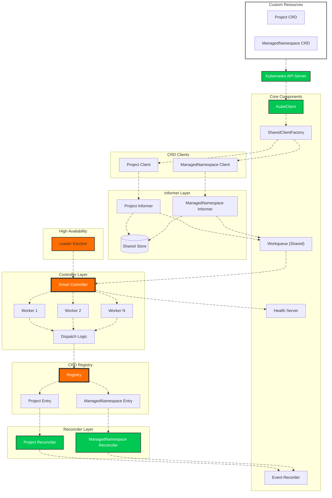

# 🚀 Multi-CRD Kubernetes Controller Framework

[](https://golang.org/)
[](https://kubernetes.io/)
[](LICENSE)

A **production-grade, multi-CRD Kubernetes controller framework** that manages multiple custom resources through a clean, registry-driven architecture. Built from scratch without controller-runtime, demonstrating deep understanding of Kubernetes internals.

Originally inspired by [@martin-helmich](https://github.com/martin-helmich/kubernetes-crd-example), this project has evolved into a **scalable, extensible operator platform** capable of managing any number of CRDs, each with its own client, informer, and reconciler.

## 🎯 **Current CRDs Supported**

| Resource | API Group | Version | Status |
|----------|-----------|---------|--------|
| `Project` | `platform.ialexeze.io` | `v1alpha1` | ✅ Production Ready |
| `ManagedNamespace` | `platform.ialexeze.io` | `v1alpha1` | ✅ Production Ready |

Adding more CRDs takes **minutes** – no controller rewrites, no code duplication.

## 🏗️ **Architecture**



## ✨ **Key Features**

### 🔥 **Multi-CRD Support**
A **registry-driven design** allows the controller to manage any number of CRDs. Each CRD contributes:
- Its own API types
- Its own informer
- Its own reconciler  
- Its own GVK metadata

**Clients are generated automatically** by the SharedClientFactory – no manual client implementation needed!

### 🧠 **Smart Controller**
A single controller processes events from **all CRDs**, dispatching them to the correct reconciler via the registry.

### 🧩 **Modular Components**
Each subsystem is a standalone, pluggable component:
- Generic KubeClient
- Event Recorder
- Health Server  
- Shared Workqueue
- Per-CRD Informers
- Per-CRD Reconcilers
- CRD Registry
- Leader Election
- Manager

### ⚙️ **Generic KubeClient**
One kubeclient powers **all** CRD clients. No CRD-specific logic lives in the kubeclient – it's truly generic.

### 📦 **Clean CRD Packages**
Each CRD lives in its own well-organized package:

```
api/types/
├── project/
│   └── v1alpha1/
│       ├── groupversion_info.go
│       ├── project_types.go
│       └── zz_generated.deepcopy.go
└── managedNamespace/
    └── v1alpha1/
        ├── groupversion_info.go
        ├── managednamespace_types.go
        └── zz_generated.deepcopy.go
```

### 🛰️ **Type-Safe Clients**
Each CRD has its own dedicated client:

```
clientset/
├── project/
│   └── v1alpha1/
│       ├── apis.go
│       └── projects.go
└── managedNamespace/
    └── v1alpha1/
        ├── apis.go
        └── managedns.go
```

### 👀 **Per-CRD Informers**
Each CRD gets its own informer, all feeding into a shared workqueue:

```
pkg/informer/
├── informer.go              # Base informer types
├── project_informer.go      # Project informer
├── managedns_informer.go    # ManagedNamespace informer
└── type.go                  # Common types
```

### 🔁 **Per-CRD Reconcilers**
Clean separation of reconciliation logic:

```
pkg/reconciler/
├── helper.go                 # Shared utilities
├── project_reconcile.go      # Project reconciliation
└── managed_ns_reconciler.go  # ManagedNamespace reconciliation
```

### 🧭 **CRD Registry**
The registry binds everything together:
- CRD metadata (Group/Version/Kind/APIPath)
- Informer instance
- Reconciler instance

## 🚀 **Quick Start**

### 1. Clone and Configure
```bash
git clone https://github.com/ialexeze/multi-crd-controller.git
cd multi-crd-controller
cp .env.example .env
# Edit .env with your configuration
```

### 2. Install CRDs
```bash
kubectl apply -f crd/bases/crd-project.yaml
kubectl apply -f crd-config/crd-managedns.yaml
```

### 3. Run Locally
```bash
# Ensure you're in the right namespace context
kubectl config set-context --current --namespace=your-namespace

go run ./cmd/
```

### 4. Create Resources
```bash
# Create projects and managed namespaces
kubectl apply -f crd/samples/project.yaml
kubectl apply -f crd/samples/managedns.yaml
```

### 5. Deploy to Production
```bash
kubectl apply -f deployment/
```

## 🔧 **Extending the Controller: Add a New CRD in Minutes**

This is where the framework truly shines. Adding a new CRD requires **zero changes** to the core controller logic.

### **Step 1: Generate API Types**

Create the API package structure:

```
api/types/yourcrd/v1alpha1/
├── groupversion_info.go
├── yourcrd_types.go
└── zz_generated.deepcopy.go
```

**groupversion_info.go:**
```go
package v1alpha1

import (
    "k8s.io/apimachinery/pkg/runtime/schema"
    "sigs.k8s.io/controller-runtime/pkg/scheme"
)

var (
    Group     = "yourgroup.example.com"
    Version   = "v1alpha1"
    APIPath   = "/apis"
    Kind      = "YourCRD"
    
    SchemeGroupVersion = schema.GroupVersion{Group: Group, Version: Version}
    
    SchemeBuilder = &scheme.Builder{GroupVersion: SchemeGroupVersion}
    AddToScheme   = SchemeBuilder.AddToScheme
)
```

**yourcrd_types.go:**
```go
package v1alpha1

import (
    metav1 "k8s.io/apimachinery/pkg/apis/meta/v1"
)

// +genclient
// +k8s:deepcopy-gen:interfaces=k8s.io/apimachinery/pkg/runtime.Object

type YourCRD struct {
    metav1.TypeMeta   `json:",inline"`
    metav1.ObjectMeta `json:"metadata,omitempty"`
    Spec              YourCRDSpec   `json:"spec"`
    Status            YourCRDStatus `json:"status,omitempty"`
}

type YourCRDSpec struct {
    // Your fields here
    Replicas int `json:"replicas"`
}

type YourCRDStatus struct {
    // Status fields
    Phase string `json:"phase,omitempty"`
}

// +k8s:deepcopy-gen:interfaces=k8s.io/apimachinery/pkg/runtime.Object

type YourCRDList struct {
    metav1.TypeMeta `json:",inline"`
    metav1.ListMeta `json:"metadata,omitempty"`
    Items           []YourCRD `json:"items"`
}
```

Generate deepcopy code:
```bash
controller-gen object paths=./api/types/yourcrd/...
```

### **Step 2: Add your CRD interface in [domain](./domain/)**
```go
type YourCRDInterface interface {
	List(ctx context.Context, opts metav1.ListOptions) (*yourcrdv1alpha.YourCRDList, error)
	Get(ctx context.Context, name string, options metav1.GetOptions) (*yourcrdv1alpha.YourCRD, error)
	Create(ctx context.Context, yourcrd *yourcrdv1alpha.YourCRD) (*yourcrdv1alpha.YourCRD, error)
	Watch(ctx context.Context, opts metav1.ListOptions) (watch.Interface, error)
	Namespace() string
	// ...
}

type YourCRDV1Alpha1nterface interface {
	Projects(namespace string) YourCRDInterface
	Namespace() string
	RestClient() rest.Interface
}
```

### **Step 3: Create the Client**

```
clientset/yourcrd/v1alpha1/
├── apis.go
└── yourcrd.go
```

**apis.go:**
```go
package v1alpha1

import (
    "context"
    
    "github.com/ialexeze/multi-crd-controller/pkg/config/domain"
    "github.com/ialexeze/multi-crd-controller/pkg/config/pkg/kubeclient"
    metav1 "k8s.io/apimachinery/pkg/apis/meta/v1"
    "k8s.io/apimachinery/pkg/runtime"
    "k8s.io/apimachinery/pkg/watch"
    "k8s.io/client-go/rest"
    
    v1alpha1 "github.com/ialexeze/multi-crd-controller/pkg/config/api/types/yourcrd/v1alpha1"
)

func (c *YourCRDClient) List(ctx context.Context, opts metav1.ListOptions) (*v1alpha1.YourCRDList, error) {
    result := v1alpha1.YourCRDList{}
    err := c.restClient.
        Get().
        Namespace(c.namespace).
        Resource("yourcrd-plural-name").
        VersionedParams(&opts, runtime.NewParameterCodec(c.scheme)).
        Do(ctx).
        Into(&result)
    return &result, err
}

// Implement Get, Create, Update, Delete, Watch...
```

**your_crd.go:**

> **NOTE**: _Add 'YourCRDResource' to [domain.go](./domain/domain.go). Useful for [queuing](./pkg/queue/queue.go) and identifying your crd with the controller._

```go
type YourCRDClient struct {
	restClient     rest.Interface
	kube           *kubeclient.Kubeclient
	opts           kubeclient.Options
	name           string
	namespace      string
	parameterCodec runtime.ParameterCodec
}

func NewYourCRDClient(kube *kubeclient.Kubeclient, opts kubeclient.Options) *YourCRDClient {
    return &YourCRDClient{
        name:           string(domain.YourCRDResource),
        kube:           kube,
        opts:           opts,
    }
}

// Entry point - started by manager in main.go
func (c *YourCRDClient) Start(ctx context.Context) error {
	if err := ctx.Err(); err != nil {
		return err
	}

	// create a parameterCodec from scheme
	c.parameterCodec = c.kube.RuntimeParameterCodec()

	// Assign rest client from shared client factory
	restClient, err := c.kube.SharedClientFactory(c.opts)
	if err != nil {
		return err
	}

	c.restClient = restClient
	return nil
}

// Implement Shutdown, Name, Namespace and RestClient to satisfy the interface...
func (c *YourCRDClient) Shutdown(ctx context.Context) {}
func (c *YourCRDClient) Name() string { return c.name }
func (c *YourCRDClient) Namespace() string { return c.namespace }
func (c *YourCRDClient) RestClient() rest.Interface { return c.restClient }
```

### **Step 4: Create the Informer**

```
pkg/informer/yourcrd_informer.go
```

```go
package informer

import (
    "github.com/ialexeze/multi-crd-controller/pkg/config/domain"
    "github.com/ialexeze/multi-crd-controller/pkg/config/pkg/queue"
)

type YourCRDInformer struct {
    client domain.YourCRDClientInterface
    Informer
}

func NewYourCRDInformer(
    client domain.YourCRDClientInterface,
    wq *queue.Workqueue,
    opts Options,
) *YourCRDInformer {
    return &YourCRDInformer{
        client: client,
        Informer: Informer{
            name:      string(domain.YourCRDInformerResource),
            queue:     wq,
            namespace: opts.Namespace,
            resync:    opts.Resync,
        },
    }
}
```

### **Step 5: Create the Reconciler**

```
pkg/reconciler/yourcrd_reconciler.go
```

```go
package reconciler

import (
    "context"
    
    "github.com/ialexeze/multi-crd-controller/pkg/config/domain"
    "github.com/ialexeze/multi-crd-controller/pkg/config/pkg/event"
    "github.com/ialexeze/multi-crd-controller/pkg/config/pkg/informer"
    "github.com/ialexeze/multi-crd-controller/pkg/config/pkg/logger"
    corev1 "k8s.io/api/core/v1"
)

type YourCRDReconciler struct {
    informer *informer.YourCRDInformer
    events   *event.Event
}

func NewYourCRDReconciler(
    informer *informer.YourCRDInformer,
    events *event.Event,
) *YourCRDReconciler {
    return &YourCRDReconciler{
        informer: informer,
        events:   events,
    }
}

func (r *YourCRDReconciler) Reconcile(ctx context.Context, key string) error {
    namespace, name, err := cache.SplitMetaNamespaceKey(key)
    if err != nil {
        return err
    }
    
    // Get object from store
    obj, exists, err := r.informer.Store().GetByKey(key)
    if err != nil || !exists {
        return r.handleDeletion(ctx, namespace, name)
    }
    
    yourcrd := obj.(*v1alpha1.YourCRD)
    
    // Your reconciliation logic here
    logger.Info().Msgf("Reconciling %s/%s", namespace, name)
    
    // Emit event
    if r.events.Recorder() != nil {
        r.events.Recorder().Eventf(
            yourcrd,
            corev1.EventTypeNormal,
            "YourCRDReconciled",
            "Successfully reconciled %s", name,
        )
    }
    
    return nil
}
```

### **Step 6: Register in `build_manager.go`**

Add these lines to your existing `cmd/build_manager.go`:

```go
// In buildScheme()
// Add your CRD to global scheme
	if err := yourCRDTypev1.AddToScheme(scheme); err != nil {
		return nil, err
	}

// In buildManager()
// 1. Create client
yourcrdClient := yourcrdClientV1alpha1.NewYourCRDClient(kube, kubeclient.Options{
    Group:     yourcrdTypev1.Group,
    Version:   yourcrdTypev1.Version,
    APIPath:   yourcrdTypev1.APIPath,
})
components = append(components, yourcrdClient)

// 2. Create informer
yourcrdInformer := informer.NewYourCRDInformer(
    yourcrdClient,
    wq,
    informer.Options{
        Namespace: cfg.Cluster().Namespace,
        Resync:    cfg.Cluster().DefaultResync,
    },
)
components = append(components, yourcrdInformer)

// 3. Create reconciler
yourcrdReconciler := reconciler.NewYourCRDReconciler(yourcrdInformer, ev)

// 4. Register with registry
reg.Register(
    domain.YourCRDResource,
    controller.CRDInfo{
        Group:   yourcrdTypev1.Group,
        Version: yourcrdTypev1.Version,
        Kind:    yourcrdTypev1.Kind,
        APIPath: yourcrdTypev1.APIPath,
    },
    yourcrdInformer,
    yourcrdReconciler,
)
```

### **Step 7: Done! 🎉**

Your controller now supports the new CRD. No core changes needed!

## 📋 **What You Get**

- ✅ **Zero duplication** – Generic layers handle all CRDs
- ✅ **Type safety** – Each CRD maintains its own types
- ✅ **Isolation** – One CRD's bugs can't affect others
- ✅ **Scalability** – Add dozens of CRDs without performance impact
- ✅ **Maintainability** – Each CRD's code lives in its own package
- ✅ **Testability** – Each reconciler can be tested independently

## 🙏 **Acknowledgments**

This project builds upon the excellent work of:
- [**@martin-helmich**](https://github.com/martin-helmich) – for the foundational CRD example
- **Kubernetes community** – for the client-go libraries and patterns

## 📄 **License**

MIT License – see [LICENSE](LICENSE)

---

**Built with ❤️ and a deep understanding of Kubernetes internals**