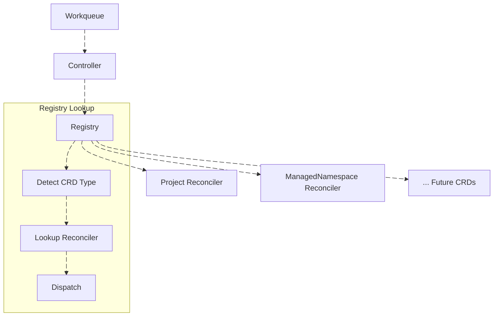

# Architectural Deep Dive

This document explains the internal architecture of the Multi‑CRD Controller Framework in detail. It covers the control loop, component lifecycle, leader election model, registry‑based dispatch, and the design decisions that make the controller **highly available**, **extensible**, and **production‑ready**.

---

## 🧠 **Core Design Philosophy**

The framework is built on three fundamental principles:

1. **Separation of Concerns** – Each component has a single, well‑defined responsibility.
2. **Registry‑Driven Dispatch** – A central registry routes events to the correct reconciler.
3. **Lifecycle Clarity** – Bootstrap vs. reconciliation phases are cleanly separated.

This approach allows the controller to manage **any number of CRDs** without changes to core components.

---

## 🔄 **Controller Lifecycle**

The controller follows the same lifecycle pattern used by Kubernetes' built‑in controllers: a clear separation between **bootstrap** and **reconciliation**.

### Bootstrap Phase (`Start()`)

The bootstrap phase runs in **every pod**, regardless of leadership. It performs all infrastructure initialization:

- Initializes the Kubernetes client and scheme
- Starts all informers (one per CRD)
- Begins watching CRD resources
- Initializes the shared workqueue
- Waits for **all** informer caches to sync
- Ensures follower pods always maintain warm caches

This design ensures that when a new leader is elected, it can begin reconciling immediately without waiting for cache warm‑up.

```go
// Simplified bootstrap flow
func (c *Controller) Start(ctx context.Context) error {
    // Start all informers
    for _, informer := range c.registry.ListInformers() {
        go informer.Run(ctx.Done())
    }
    
    // Wait for all caches to sync
    for _, informer := range c.registry.ListInformers() {
        if !cache.WaitForCacheSync(ctx.Done(), informer.HasSynced) {
            return fmt.Errorf("cache sync failed")
        }
    }
    
    return nil
}
```

### Reconciliation Phase (`Run()`)

The reconciliation phase runs **only in the leader**. It is responsible for:

- Starting N worker goroutines (configurable per CRD)
- Pulling items from the shared workqueue
- Dispatching to the correct reconciler via the registry
- Executing reconciliation logic
- Respecting context cancellation
- Draining in‑flight reconciliations when leadership is lost

Workers stop cleanly when the leader election context is cancelled, ensuring no partial or duplicate reconciliations.

---

## 📦 **Component Deep Dive**

### 1. **Configuration Layer** (`pkg/config`)

Environment‑based configuration with `.env` support for development and system variables for production:

```go
cfg, err := config.Init() // Automatically loads .env file, falls back to system env
```

The configuration system validates required fields and normalizes environment names (dev/staging/prod) for consistent behavior across deployments.

### 2. **Health Server** (`pkg/health`)

Provides Kubernetes liveness and readiness endpoints with environment‑aware logging:

- `/health` – Returns 200 when the service is running (no logs in production)
- `/ready` – Returns 200 only after manager calls `SetReady()` (no logs in production)

Conditional logging prevents noisy probe logs in production (`APP_ENV=production`).

### 3. **Generic KubeClient** (`pkg/kubeclient`)

A **truly generic** Kubernetes client that powers both built‑in and custom resources:

```go
kube := kubeclient.NewKubeclient(kubeclient.Options{
    Kubeconfig: cfg.Cluster().KubeconfigPath,
    Masterurl:  cfg.Cluster().MasterURL,
    Scheme:     scheme,  // Scheme with ALL CRDs registered
})
```

- Provides standard `clientset` for built‑in types
- Provides `restClient` configured for CRD operations
- **No CRD‑specific logic** – the same client works for any CRD

### 4. **Shared Workqueue** (`pkg/queue`)

A single, rate‑limited workqueue that **all informers feed into**:

```go
wq := queue.NewWorkqueue()
```

- Rate limiting prevents reconcile storms
- Shared across all CRDs for unified processing
- Configurable workers control concurrency
- Exponential backoff on errors

### 5. **CRD Clients** (`clientset/`)

Each CRD gets its own type‑safe client, generated following Kubernetes patterns:

```
clientset/
├── project/                 # Project CRD client
│   └── v1alpha1/
│       ├── apis.go          # Interface definitions
│       └── projects.go      # CRUD implementation
└── managedNamespace/        # ManagedNamespace CRD client
    └── v1alpha1/
        ├── apis.go          # Interface definitions
        └── managedns.go     # CRUD implementation
```

Each client provides:
- `List()`, `Get()`, `Create()`, `Update()`, `Delete()`, `Watch()`

### 6. **Per‑CRD Informers** (`pkg/informer/`)

Each CRD has its own informer, all feeding into the shared workqueue:

```
pkg/informer/
├── informer.go               # Base informer types
├── project_informer.go       # Project‑specific informer
├── managedns_informer.go     # ManagedNamespace informer
└── type.go                   # Common types
```

Each informer:
- List/Watches its CRD type via the Kubernetes API
- Maintains a thread‑safe local store
- Enqueues events (Add/Update/Delete) to the shared workqueue
- Periodically resyncs based on configuration

```go
// Simplified informer registration
func NewProjectInformer(client domain.ProjectClientInterface, wq *queue.Workqueue, opts Options) *ProjectInformer {
    return &ProjectInformer{
        client: client,
        Informer: Informer{
            name:      string(domain.ProjectResource),
            queue:     wq,
            namespace: opts.Namespace,
            resync:    opts.Resync,
        },
    }
}
```

### 7. **Event Recorder** (`pkg/event`)

Broadcasts Kubernetes events for controller visibility:

```go
ev := event.NewEvent(kube, scheme, event.Options{Component: cfg.App().Name})
```

- Used by leader election to emit leadership events
- Used by reconcilers to emit resource events
- Events appear in `kubectl describe` and `kubectl get events`

### 8. **Per‑CRD Reconcilers** (`pkg/reconciler/`)

Each CRD has its own reconciler with clean separation of logic:

```
pkg/reconciler/
├── helper.go                 # Shared utilities
├── project_reconcile.go      # Project reconciliation logic
└── managed_ns_reconciler.go  # ManagedNamespace reconciliation logic
```

Each reconciler implements:
```go
type Reconciler interface {
    Reconcile(ctx context.Context, key string) error
}
```

The `key` format is `namespace/name`. Reconcilers:
- Fetch the object from the informer's store
- Handle deletion cases (object not found)
- Execute business logic (provision resources, update status)
- Emit Kubernetes events for visibility

### 9. **CRD Registry** (`pkg/controller/registry.go`)

The **heart of the multi‑CRD architecture** – a registry that binds everything together:

```go
reg := controller.NewRegistry()
reg.Register(
    domain.ProjectResource,
    controller.CRDInfo{
        Group:   projectTypev1.Group,
        Version: projectTypev1.Version,
        Kind:    projectTypev1.Kind,
        APIPath: projectTypev1.APIPath,
    },
    projInformer,
    projReconciler,
)
reg.Register(
    domain.ManagedNamespaceResource,
    controller.CRDInfo{
        Group:   mnsTypev1.Group,
        Version: mnsTypev1.Version,
        Kind:    mnsTypev1.Kind,
        APIPath: mnsTypev1.APIPath,
    },
    mnsInformer,
    mnsReconciler,
)
```

The registry provides:
- Central source of truth for all CRDs
- Dispatch mechanism for the controller
- Type‑safe access to informers and reconcilers
- Ability to add new CRDs **without touching controller code**

### 10. **Smart Controller** (`pkg/controller`)

A **single controller** that processes events for **all CRDs**:

```go
ctrl := controller.NewController(
    kube,
    reg,    // Registry with all CRDs
    ev,     // Event recorder
    wq,     // Shared workqueue
    cfg.Cluster().Workers,
)
```

The controller:
- Starts N worker goroutines (configurable)
- Pulls items from the shared workqueue
- Uses the registry to **dispatch to the correct reconciler**
- Handles rate limiting and retries
- **Never needs to change** when new CRDs are added

```go
// Simplified dispatch logic
func (c *Controller) processNextItem(ctx context.Context) bool {
	// Wait until there's an item or the queue is shut down
	item, shutdown := c.q.Queue.Get()
	if shutdown {
		return false
	}

	// We call Done at the end of this function to mark the item as processed
	defer c.q.Queue.Done(item)

	// Find the right reconciler
	var targetReconciler domain.Reconciler
	for _, r := range c.reconcilers {
		if r.Resource() == item.Resource {
			targetReconciler = r
			break
		}
	}

	if targetReconciler == nil {
		logger.Error().Str("resource", string(item.Resource)).Msg("no reconciler found")
		c.q.Queue.Forget(item)
		return true
	}

	// Reconcile
	if err := targetReconciler.Reconcile(ctx, item.Key); err != nil {
		logger.Error().
			Err(err).
			Str("resource", string(item.Resource)).
			Str("key", item.Key).
			Msg("reconcile failed")
		c.q.Queue.AddRateLimited(item)
		return true
	}

	c.q.Queue.Forget(item)
	return true
}
```

### 11. **Leader Election** (`pkg/leader`)

Ensures only one instance reconciles at a time:

```go
leader := leader.NewLeaderElection(
    kube,
    ev,                                      // For leader events
    func(ctx context.Context) { ctrl.Run(ctx) }, // Controller run function
    leader.Options{
        Namespace:     cfg.Cluster().Namespace,
        LeaseDuration: cfg.Leader().LeaseDuration,
        RenewDeadline: cfg.Leader().RenewDeadline,
        RetryPeriod:   cfg.Leader().RetryPeriod,
    })
```

Features:
- Acquires lease via Kubernetes Coordination API
- **Only leader runs the controller workers**
- Emits leader election events
- Releases lease on graceful shutdown (`ReleaseOnCancel: true`)
- Followers maintain warm caches for instant failover

### 12. **Manager** (`pkg/manager`)

The orchestrator that brings everything together:

```go
mgr := manager.NewManager(hs, cfg.Cluster().DefaultResync)

// Register all components
for _, comp := range components {
    mgr.Register(comp)
    logger.Info().Msgf("[%s] component registered", comp.Name())
}

// Start all components in order
mgr.Start(ctx)

// Wait for shutdown
mgr.Wait()
```

The manager:
- Registers all components (health, kube, clients, informers, controller, leader)
- Starts them in the correct order
- Handles graceful shutdown on SIGINT/SIGTERM
- Sets the health server ready only after all components are running
- Shuts down components in **reverse order** (leader election first!)

---

## 🎯 **Registry‑Driven Dispatch**

The registry pattern is the key innovation that enables multi‑CRD support:



When an event arrives:
1. Controller pulls a key from the queue
2. Registry detects which CRD the key belongs to (by API group/version)
3. Registry returns the correct reconciler
4. Controller calls `Reconcile()`

**Adding a new CRD** requires only:
- API types
- Client
- Informer  
- Reconciler
- One line in `buildManager()` to register

**Zero changes** to controller, kubeclient, or core logic.

---

## ⚡ **Leader Election Model**

The controller uses Kubernetes' coordination API to ensure that only one pod performs reconciliation at any time.

### Key Properties

- **Only the leader runs workers** (`Run()`).
- **All pods run informers** (`Start()`).
- **Failover is instant** because followers maintain warm caches.
- **Lease is released on shutdown** for fast leadership transitions.
- **Events are emitted** for visibility into leadership changes.

### Leadership Loss and Draining

When leadership is lost:

1. The leader election context is cancelled.
2. Workers stop accepting new items.
3. The queue is shut down.
4. In‑flight reconciliations finish.
5. The controller exits cleanly.

This prevents double‑processing and ensures consistency.

```go
// Simplified draining logic
func (c *Controller) Run(ctx context.Context) {
    for i := 0; i < c.workers; i++ {
        go func() {
            for {
                select {
                case <-ctx.Done():
                    return // Stop when leadership lost
                default:
                    if !c.processNextItem(ctx) {
                        return
                    }
                }
            }
        }()
    }
}
```

---

## 🧪 **Why Raw client‑go Instead of controller‑runtime?**

This controller intentionally uses **client‑go** directly rather than controller‑runtime. The goals are:

- **Full visibility** into the control loop
- **Explicit lifecycle** management
- **No hidden abstractions**
- **Lightweight**, dependency‑minimal design
- **Ideal for learning** and debugging
- **Flexible** for custom lifecycle behavior (registry dispatch, post‑start hooks)

controller‑runtime is excellent for large operators, but it hides many details behind abstractions. This implementation is ideal for developers who want to **understand and control** the underlying mechanics.

---

## 📈 **Performance and Scaling**

### Horizontal Scaling

Multiple replicas can run simultaneously:

- Only one pod becomes leader
- Followers maintain warm caches
- Failover is instant (sub‑second)

### Vertical Scaling

You can tune per CRD:

- Worker count (`WORKERS`)
- Resync period (`DEFAULT_RESYNC`)
- Queue rate limiting
- Reconciliation concurrency

### Queue Behavior

The workqueue provides:

- Exponential backoff on errors
- Deduplication of keys
- Shutdown‑aware draining

This ensures stable performance under load.

---

## 🧪 **Testing Strategy**

The architecture supports testing at multiple layers:

| Layer | Testing Approach |
|-------|------------------|
| **Unit Tests** | Fake clients for reconciler logic |
| **Informer Tests** | Fake watch streams |
| **Queue Tests** | Verify retry and backoff behavior |
| **Leader Election** | Simulate leadership loss |
| **Integration** | `envtest` or local cluster |
| **E2E** | Full controller in kind cluster |

---

## 🛣️ **Roadmap**

Planned enhancements include:

- ✅ Multi‑CRD support (implemented!)
- 📊 Prometheus metrics (reconciliation duration, queue depth)
- 🧩 Admission webhooks (validation/defaulting)
- 🔧 Finalizer framework
- 📦 Helm chart for deployment
- 🔌 Pluggable reconciler modules
- ⚡ Optional controller‑runtime compatibility layer

---

## 🎯 **Summary**

This architecture delivers:

| Requirement | Implementation |
|-------------|----------------|
| **Multi‑CRD support** | Registry‑driven dispatch |
| **High availability** | Leader election + warm caches |
| **Extensibility** | Add CRDs in minutes, zero core changes |
| **Production readiness** | Health checks, graceful shutdown |
| **Observability** | Events, structured logs |
| **Performance** | Shared queue, rate limiting, workers |
| **Testability** | Clean interfaces, fake implementations |

The result is a **production‑grade, extensible controller framework** that can grow with your needs – from a single CRD to dozens – without architectural changes.