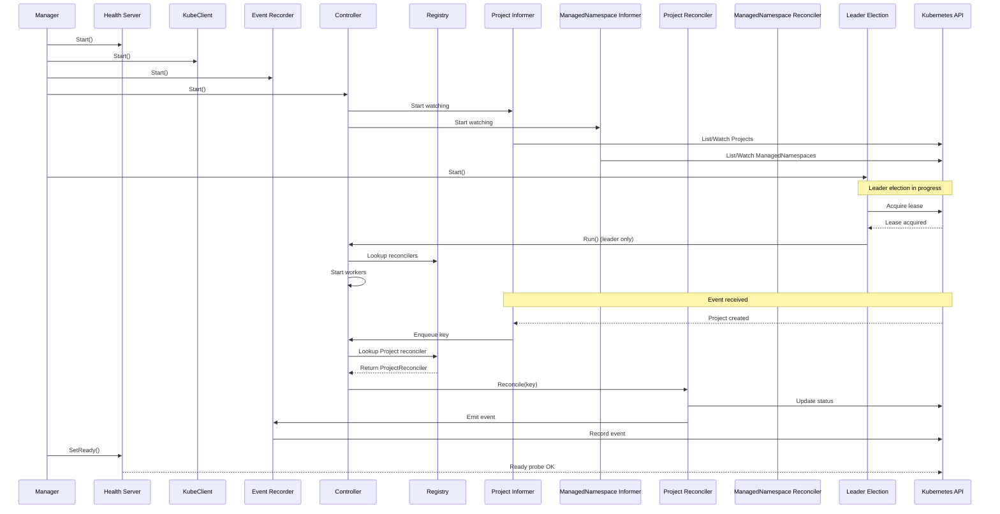

# 🏗️ **Component Deep Dive**

## 1. **Configuration** (`pkg/config`)
Environment-based configuration with `.env` support for development and system variables for production:

```go
cfg, err := config.Init() // Automatically loads .env file, falls back to system env
```

The configuration system validates required fields and normalizes environment names (dev/staging/prod) for consistent behavior across deployments.

---

## 2. **Health Server** (`pkg/health`)
Provides Kubernetes liveness and readiness endpoints with environment-aware logging:

```go
hs := health.NewHealthServer("projects", cfg)
components = append(components, hs)
```

- `/health` - Returns 200 when the service is running (no logs in production)
- `/ready` - Returns 200 only after manager calls `SetReady()` (no logs in production)
- Conditional logging prevents noisy probe logs in production (`APP_ENV=production`)

The health server is the first component to start and the last to shut down, ensuring proper orchestration.

---

## 3. **KubeClient** (`pkg/kubeclient`)
A **generic** Kubernetes client that powers both built-in and custom resources:

```go
kube := kubeclient.NewKubeclient(kubeclient.Options{
    Kubeconfig: cfg.Cluster().KubeconfigPath,
    Masterurl:  cfg.Cluster().MasterURL,
    Scheme:     scheme,  // Scheme with all CRDs registered
})
```

- Provides standard `clientset` for built-in types
- Provides `restClient` configured for CRD operations
- No CRD-specific logic – truly generic

---

## 4. **Workqueue** (`pkg/queue`)
A shared, rate-limited workqueue that all informers feed into:

```go
wq := queue.NewWorkqueue()
components = append(components, wq)
```

- Rate limiting prevents reconcile storms
- Shared across all CRDs for unified processing
- Configurable workers control concurrency

---

## 5. **CRD Clients** (`clientset/`)
Each CRD gets its own type-safe client:

```go
projectsClient := projectsClientV1alpha1.NewProjectClient(kube, scheme, opts)
managedNamespaceClient := mnsClientV1alpha1.NewManagednsClient(kube, scheme, opts)
```

**Project Client Structure:**
```
clientset/project/v1alpha1/
├── apis.go      # Interface definitions
└── projects.go  # CRUD implementation
```

**ManagedNamespace Client Structure:**
```
clientset/managedNamespace/v1alpha1/
├── apis.go       # Interface definitions
└── managedns.go  # CRUD implementation
```

Each client provides:
- `List()` - List all resources
- `Get()` - Get a specific resource
- `Create()` - Create a new resource
- `Update()` - Update an existing resource
- `Delete()` - Delete a resource
- `Watch()` - Watch for changes

---

## 6. **Informers** (`pkg/informer`)
Each CRD has its own informer, all feeding into the shared workqueue:

```go
projInformer := informer.NewProjectInformer(projectsClient, wq, informer.Options{
    Namespace: cfg.Cluster().Namespace,
    Resync:    cfg.Cluster().DefaultResync,
})

mnsInformer := informer.NewManagedNamespaceInformer(managedNamespaceClient, wq, informer.Options{
    Namespace: cfg.Cluster().Namespace,
    Resync:    cfg.Cluster().DefaultResync,
})
```

**Informer Structure:**
```
pkg/informer/
├── informer.go               # Base informer types
├── project_informer.go       # Project-specific informer
├── managedns_informer.go     # ManagedNamespace informer
└── type.go                   # Common types
```

Each informer:
- List/Watches its CRD type via the Kubernetes API
- Maintains a thread-safe local store
- Enqueues events (Add/Update/Delete) to the shared workqueue
- Periodically resyncs based on configuration

---

## 7. **Event Recorder** (`pkg/event`)
Broadcasts Kubernetes events for controller visibility:

```go
ev := event.NewEvent(kube, scheme, event.Options{Component: cfg.App().Name})
components = append(components, ev)
```

- Used by leader election to emit leadership events
- Used by reconcilers to emit resource events
- Events appear in `kubectl describe` and `kubectl get events`

---

## 8. **Reconcilers** (`pkg/reconciler`)
Each CRD has its own reconciler with clean separation of logic:

```go
projReconciler := reconciler.NewProjectReconciler(projInformer, ev)
mnsReconciler := reconciler.NewManagedNamespaceReconciler(kube, mnsInformer, ev)
```

**Reconciler Structure:**
```
pkg/reconciler/
├── helper.go                 # Shared utilities
├── project_reconcile.go      # Project reconciliation logic
└── managed_ns_reconciler.go  # ManagedNamespace reconciliation logic
```

Each reconciler implements:
```go
type Reconciler interface {
    Reconcile(ctx context.Context, key string) error
}
```

The `key` format is `namespace/name`, and reconcilers:
- Fetch the object from the informer's store
- Handle deletion cases (object not found)
- Execute business logic (provision resources, update status)
- Emit Kubernetes events for visibility

---

## 9. **CRD Registry** (`pkg/controller/registry.go`)
The heart of the multi‑CRD architecture – a registry that binds everything together:

```go
reg := controller.NewRegistry()
reg.Register(
    domain.ProjectResource,
    controller.CRDInfo{
        Group:   projectTypev1.Group,
        Version: projectTypev1.Version,
        Kind:    projectTypev1.Kind,
        APIPath: projectTypev1.APIPath,
    },
    projInformer,
    projReconciler,
)
reg.Register(
    domain.ManagedNamespaceResource,
    controller.CRDInfo{
        Group:   mnsTypev1.Group,
        Version: mnsTypev1.Version,
        Kind:    mnsTypev1.Kind,
        APIPath: mnsTypev1.APIPath,
    },
    mnsInformer,
    mnsReconciler,
)
```

The registry provides:
- Central source of truth for all CRDs
- Dispatch mechanism for the controller
- Type-safe access to informers and reconcilers

---

## 10. **Controller** (`pkg/controller`)
A **single, smart controller** that processes events for all CRDs:

```go
ctrl := controller.NewController(
    kube,
    reg,    // Registry with all CRDs
    ev,     // Event recorder
    wq,     // Shared workqueue
    cfg.Cluster().Workers,
)
components = append(components, ctrl)
```

The controller:
- Starts N worker goroutines (configurable)
- Pulls items from the shared workqueue
- Uses the registry to dispatch to the correct reconciler
- Handles rate limiting and retries
- Never needs to change when new CRDs are added

---

## 11. **Leader Election** (`pkg/leader`)
Ensures only one instance reconciles at a time:

```go
leader := leader.NewLeaderElection(
    kube,
    ev,                                      // For leader events
    func(ctx context.Context) { ctrl.Run(ctx) }, // Controller run function
    leader.Options{
        Namespace:     cfg.Cluster().Namespace,
        LeaseDuration: cfg.Leader().LeaseDuration,
        RenewDeadline: cfg.Leader().RenewDeadline,
        RetryPeriod:   cfg.Leader().RetryPeriod,
    })
components = append(components, leader)
```

Features:
- Acquires lease via Kubernetes Coordination API
- Only leader runs the controller
- Emits leader election events
- Releases lease on graceful shutdown (`ReleaseOnCancel: true`)

---

## 12. **Manager** (`pkg/manager`)
The orchestrator that brings everything together:

```go
mgr := manager.NewManager(hs, cfg.Cluster().DefaultResync)

// Register all components
for _, comp := range components {
    mgr.Register(comp)
    logger.Info().Msgf("[%s] component registered", comp.Name())
}

// Start all components in order
mgr.Start(ctx)

// Wait for shutdown
mgr.Wait()
```

The manager:
- Registers all components (health, kube, clients, informers, controller, leader)
- Starts them in the correct order
- Handles graceful shutdown on SIGINT/SIGTERM
- Sets the health server ready only after all components are running
- Shuts down components in reverse order (leader election first!)

---

## 🎯 **Component Interaction Flow**



This architecture ensures:
- **Single responsibility** – Each component does one thing well
- **Loose coupling** – Components interact through clean interfaces
- **Extensibility** – New CRDs need zero changes to core components
- **Testability** – Each component can be tested in isolation
- **Production readiness** – Health checks, graceful shutdown, leader election